# MATLAB App Designer Visualization Components
[](https://matlab.mathworks.com/open/github/v1?repo=mathworks/App-Designer-Visualization-Components)
[](https://www.mathworks.com/matlabcentral/fileexchange/184727)

## Custom Visualization UI Components

This repository contains 17 custom UI components that make additional
MATLAB&reg; visualization objects available in App Designer. The components
wrap charts, axes, and image viewers that are not available as standard
drag-and-drop App Designer components.

Without these components, adding visualizations such as geographic axes,
polar axes, and image or volume viewers requires custom construction,
parenting, and lifecycle code.

Each component can be placed and resized in an app, configured through its
public properties, and updated programmatically.

## Included Components

| Component | Wrapped visualization | Component Library category | Required product |
| --- | --- | --- | --- |
| `uigeoaxes` | Geographic axes | `Visualization - Axes & Maps` | MATLAB |
| `uimapaxes` | Projected map axes | `Visualization - Axes & Maps` | Mapping Toolbox&trade; |
| `uiaxesm` | Classic axesm-based map | `Visualization - Axes & Maps` | Mapping Toolbox |
| `uipolaraxes` | Polar axes | `Visualization - Axes & Maps` | MATLAB |
| `uiheatmap` | Heatmap chart | `Visualization - Charts` | MATLAB |
| `uiparallelplot` | Parallel coordinates plot | `Visualization - Charts` | MATLAB |
| `uistackedplot` | Stacked plot | `Visualization - Charts` | MATLAB |
| `uiscatterhistogram` | Scatter plot with marginal histograms | `Visualization - Charts` | MATLAB |
| `uismithplot` | Smith chart | `Visualization - RF & Antennas` | RF Toolbox&trade;, Antenna Toolbox&trade;, or SerDes Toolbox&trade; |
| `uiwordcloud` | Word cloud | `Visualization - Charts` | MATLAB |
| `uibubblecloud` | Bubble cloud | `Visualization - Charts` | MATLAB |
| `uigeobubble` | Geographic bubble chart | `Visualization - Axes & Maps` | MATLAB |
| `uiconfusionchart` | Confusion matrix chart | `Visualization - Charts` | Statistics and Machine Learning Toolbox&trade; or Deep Learning Toolbox&trade; |
| `uisliceviewer` | 2-D slice viewer for 3-D image data | `Visualization - Image & Volume` | Image Processing Toolbox&trade; |
| `uiorthosliceviewer` | Orthogonal slice viewer for 3-D image data | `Visualization - Image & Volume` | Image Processing Toolbox |
| `uivolshow` | Interactive 3-D volume visualization | `Visualization - Image & Volume` | Image Processing Toolbox |
| `uipattern` | Antenna radiation pattern | `Visualization - RF & Antennas` | Antenna Toolbox |

## Features

- **App Designer integration**: Add visualizations to apps as reusable custom
  components.
- **Design-time layout**: Position and resize components in App Designer.
- **Programmatic updates**: Load or replace data from app callbacks.
- **Access to wrapped objects**: Customize the underlying chart or viewer when
  more control is needed.
- **Examples included**: Demonstration apps show how to configure and update
  the components.

## Setup

1. Download or clone this repository.
2. In MATLAB, navigate to the repository folder.
3. Run:

   ```matlab
   componentNames = setupPanelWrappedComponents
   ```

4. Restart App Designer if it is already open so that its Component Library
   refreshes.
5. Open or create an app and locate each component in its assigned Component
   Library category. The categories are listed in the
   [Included Components](#included-components) table and defined in
   [`resources/appDesigner.json`](resources/appDesigner.json).
6. Drag a component onto the App Designer canvas and configure it using the
   Component Browser or app code.

## Getting Started

Open [`doc/GettingStarted.m`](doc/GettingStarted.m) in the MATLAB Live Editor
for a runnable introduction:

```matlab
open("doc/GettingStarted.m")
```

Use the component's public methods and properties from App Designer callbacks.
For example, load the sample MRI volume into an orthogonal slice viewer:

```matlab
load mri
V = squeeze(D);
plot(app.uiorthosliceviewer, V)
```

The examples below assume that App Designer assigned the component property
the same name as its class, such as `app.uiheatmap`. If you renamed a
component, use its name from the Component Browser instead.

### Using the `plot` Methods

Twelve components provide a `plot` method that follows the syntax of the
wrapped MATLAB function or viewer constructor:

```matlab
object = plot(component, dataArguments)
object = plot(component, dataArguments, Name=Value)
```

- Pass the App Designer component as the first input.
- After the component input, use the same data arguments and name-value
  arguments documented for the wrapped MATLAB function.
- Do not specify `Parent`. The component manages the parent container.
- The output is the underlying MATLAB chart or viewer object. The output is
  optional if you only need to display the data.
- For wrapped charts and viewers, calling `plot` again replaces the underlying
  object, so a handle returned by an earlier call is no longer valid.
  `uipattern` instead updates and reuses its existing surface.

For example, these native and component calls use equivalent data arguments:

```matlab
nativeChart = heatmap(data, ColorbarVisible="off");
wrappedChart = plot(app.uiheatmap, data, ...
    ColorbarVisible="off");
```

The sections below list the principal supported syntaxes. Follow the linked
MathWorks documentation for complete input and name-value options.

## Component Gallery and Usage

### Geographic Axes (`uigeoaxes`)

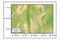

Use `geoplot`, `geoscatter`, `geobubble`, or `geodensityplot` with the
component as the first input. Use `geobasemap` and `geolimits` to control the
map display.

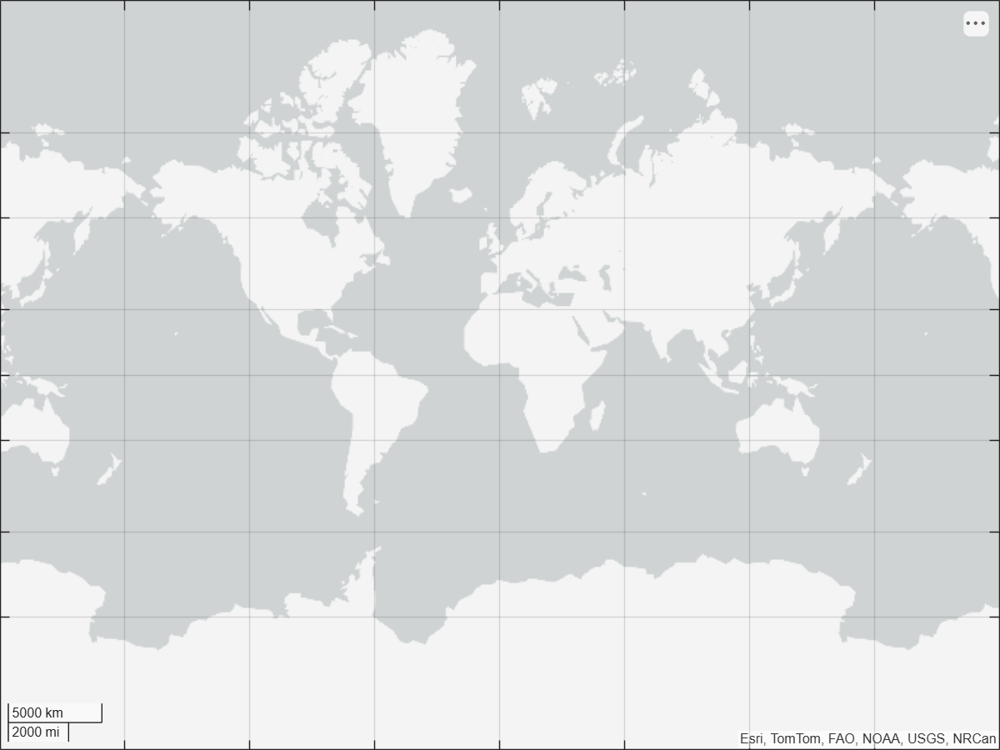

```matlab
latitude = [42.36 40.71];
longitude = [-71.06 -74.01];

geoplot(app.uigeoaxes, latitude, longitude, "-o")
geobasemap(app.uigeoaxes, "streets-light")
```

### Projected Map Axes (`uimapaxes`)

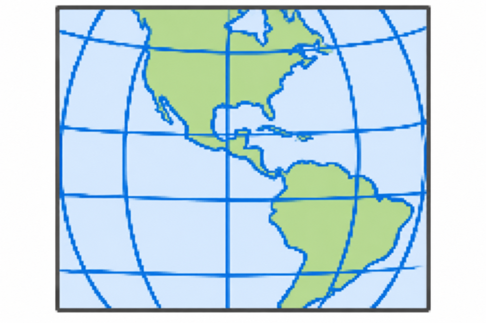

Use `uimapaxes` to display geographic data in a projected coordinate
reference system. The component contains a Mapping Toolbox `MapAxes` object,
not a UI axes. Use `geoplot`, `geoscatter`, and `geolimits` with the component
as the first input.

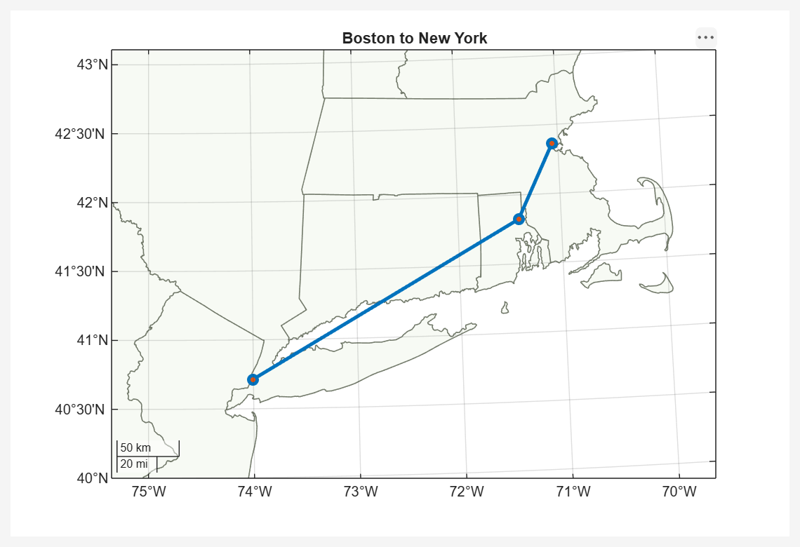

```matlab
app.uimapaxes.ProjectedCRS = projcrs(26918);

latitude = [42.36 40.71];
longitude = [-71.06 -74.01];

geoplot(app.uimapaxes, latitude, longitude, "-o")
geolimits(app.uimapaxes, [40 43], [-75 -70])
title(app.uimapaxes, "Boston to New York")
```

Call `newmap` to clear the map and apply another projection:

```matlab
newmap(app.uimapaxes, projcrs(3857))
```

Set `MapLayout` and `ScalebarVisible` to control the map display. Access the
wrapped object through the read-only `MapAxes` property for additional
customization.

`MapAxes` does not support `geobasemap` or `geodensityplot`. Use
`uigeoaxes` when the app requires a tiled basemap or a geographic density
plot.

### Classic Map Axes (`uiaxesm`)

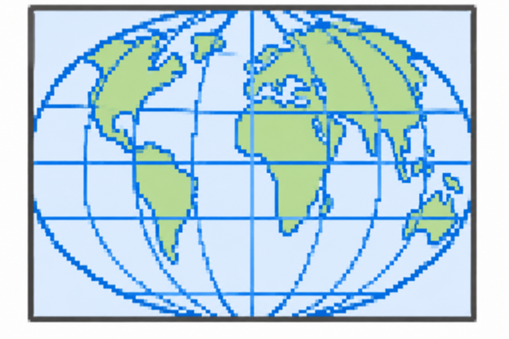

Use `uiaxesm` for classic Mapping Toolbox workflows that are not available
with geographic axes or `mapaxes`, including `plotm`, `geoshow`, `surfacem`,
`meshm`, `contourm`, `patchm`, map frames, graticules, and geographic labels.
The component hosts an `axesm`-based map inside the app.

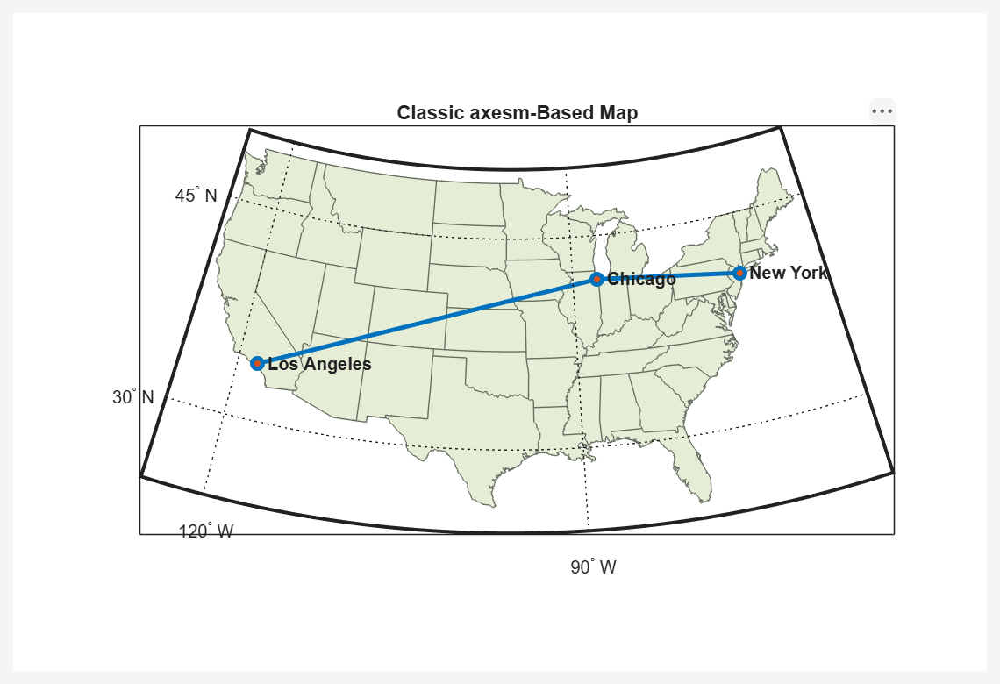

Configure the projection with `resetmap`, then pass the component as the first
input to classic map display functions:

```matlab
resetmap(app.uiaxesm, "eqaconic", ...
    MapLatLimit=[24 50], ...
    MapLonLimit=[-125 -66], ...
    MapParallels=[29.5 45.5], ...
    Origin=[0 -96 0])

states = readgeotable("usastatelo.shp");
geoshow(app.uiaxesm, states, ...
    FaceColor=[0.90 0.93 0.84], ...
    EdgeColor=[0.40 0.43 0.38])

hold(app.uiaxesm, "on")
plotm(app.uiaxesm, ...
    [34.0522 41.8781 40.7128], ...
    [-118.2437 -87.6298 -74.0060], "-o")
```

Use `gridm`, `framem`, `mlabel`, and `plabel` to control classic map
decorations. The read-only `MapAxes` property provides access to the wrapped
MATLAB axes. Changing `MapProjection`, `MapLatitudeLimits`, or
`MapLongitudeLimits` rebuilds the map and clears its plotted content.

Choose `uiaxesm` for classic projection and `*m` functionality. Choose
`uimapaxes` for modern `projcrs`, `geoplot`, and `geoscatter` workflows, or
`uigeoaxes` for tiled basemaps.

### Polar Axes (`uipolaraxes`)

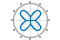

Use the component as the first input to `polarplot`, `polarscatter`, or
`polarhistogram`.

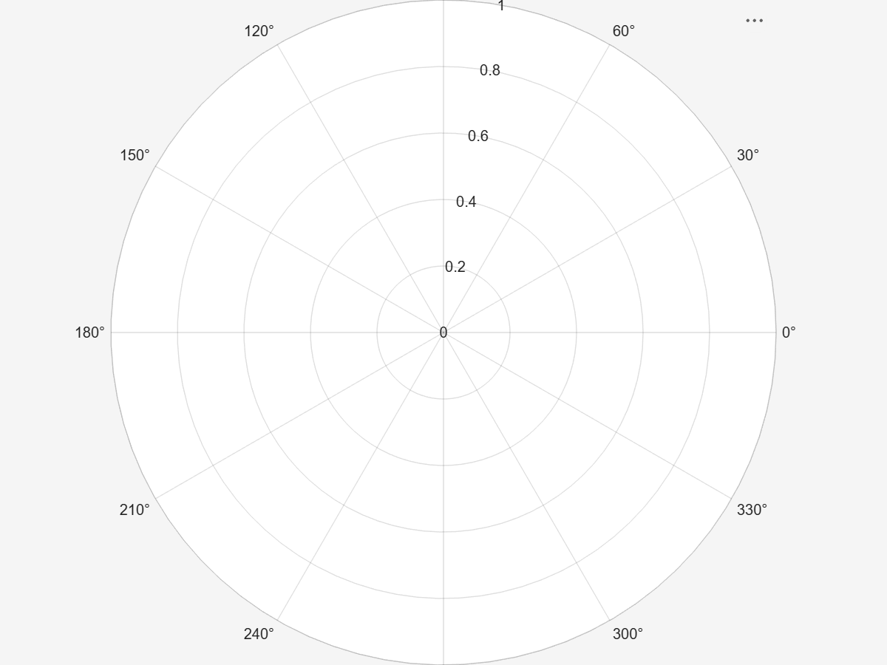

```matlab
theta = linspace(0, 2*pi, 200);
rho = abs(sin(3*theta));

polarplot(app.uipolaraxes, theta, rho)
title(app.uipolaraxes, "Polar Plot")
```

### Heatmap (`uiheatmap`)

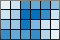

Assign a numeric matrix to `ColorData`, or use `setData` to update the matrix
and its axis labels together. The `plot` method accepts the data arguments of
[`heatmap`](https://www.mathworks.com/help/matlab/ref/heatmap.html).

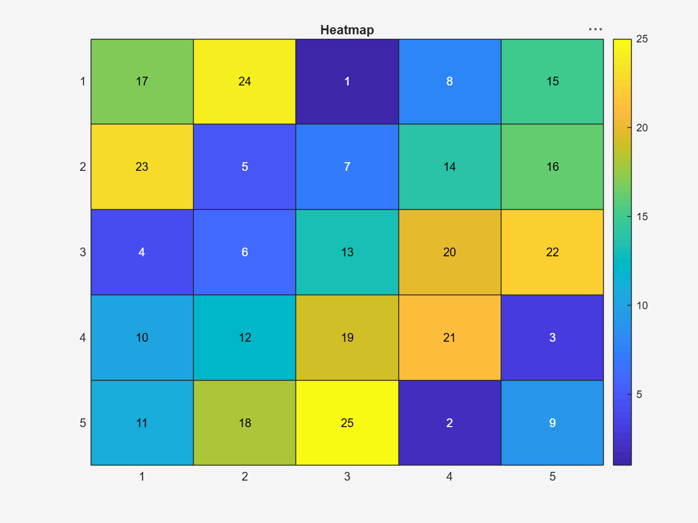

```matlab
chart = plot(component, colorData)
chart = plot(component, xValues, yValues, colorData)
chart = plot(component, tableData, xVariable, yVariable)
chart = plot(component, ___, Name=Value)
```

```matlab
data = magic(5);
xLabels = {'A','B','C','D','E'};
yLabels = {'1','2','3','4','5'};

setData(app.uiheatmap, data, xLabels, yLabels)
app.uiheatmap.Title = "Heatmap";
```

### Parallel Coordinates Plot (`uiparallelplot`)

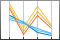

Pass a numeric matrix or table to `plot`. Set `GroupData` to color observations
by group. The remaining inputs follow
[`parallelplot`](https://www.mathworks.com/help/matlab/ref/parallelplot.html).

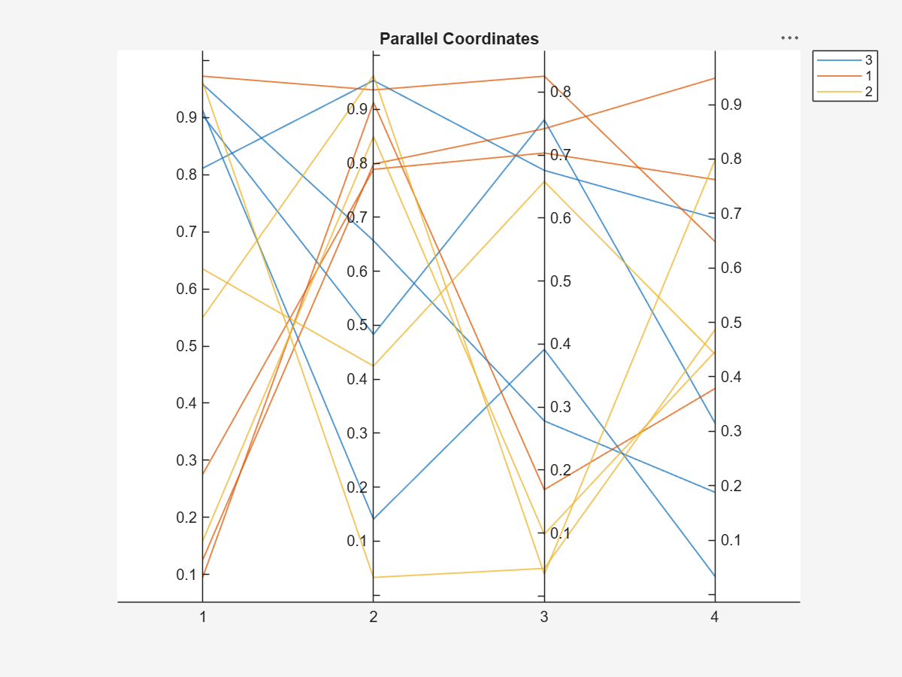

```matlab
chart = plot(component, matrixData)
chart = plot(component, tableData)
chart = plot(component, ___, Name=Value)
```

```matlab
data = rand(12, 4);
plot(app.uiparallelplot, data)

app.uiparallelplot.GroupData = categorical(randi(3, 12, 1));
app.uiparallelplot.Title = "Parallel Coordinates";
```

### Stacked Plot (`uistackedplot`)

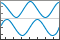

Create a timetable or table and assign it to `SourceTable`. Use
`DisplayVariables` to select which variables appear in the stacked plot.

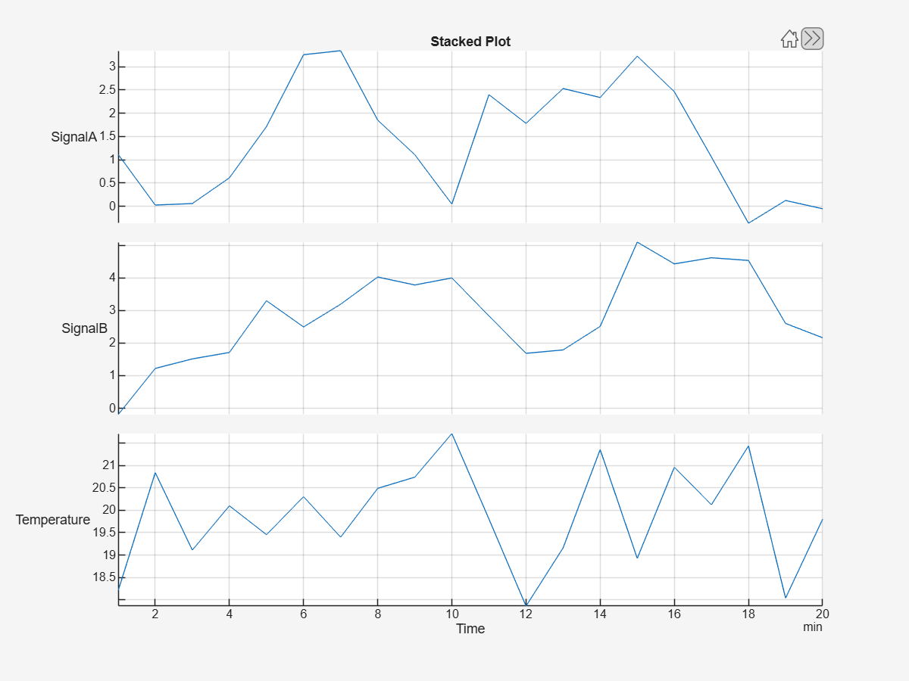

```matlab
time = (datetime(2026,1,1) + days(0:19))';
temperature = 20 + randn(20,1);
pressure = 100 + randn(20,1);

app.uistackedplot.SourceTable = ...
    timetable(time, temperature, pressure);
app.uistackedplot.DisplayVariables = ...
    ["temperature" "pressure"];
```

### Scatter Histogram (`uiscatterhistogram`)

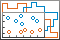

Pass x- and y-data to `plot`. The method also accepts the same data arguments
and name-value options as
[`scatterhistogram`](https://www.mathworks.com/help/matlab/ref/scatterhistogram.html).

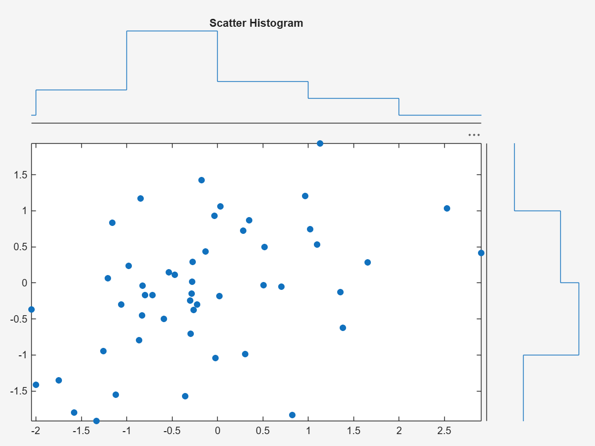

```matlab
chart = plot(component, xValues, yValues)
chart = plot(component, tableData, xVariable, yVariable)
chart = plot(component, ___, Name=Value)
```

```matlab
x = randn(100,1);
y = 0.6*x + randn(100,1);

plot(app.uiscatterhistogram, x, y)
app.uiscatterhistogram.Title = "Scatter Histogram";
```

### Smith Plot (`uismithplot`)

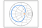

Pass complex data, frequency and complex data, or network-parameter data to
`plot`. Use `addData` to add another data series without replacing the chart.
See the [`smithplot`](https://www.mathworks.com/help/rf/ref/smithplot.html)
documentation for the supported network-parameter inputs.

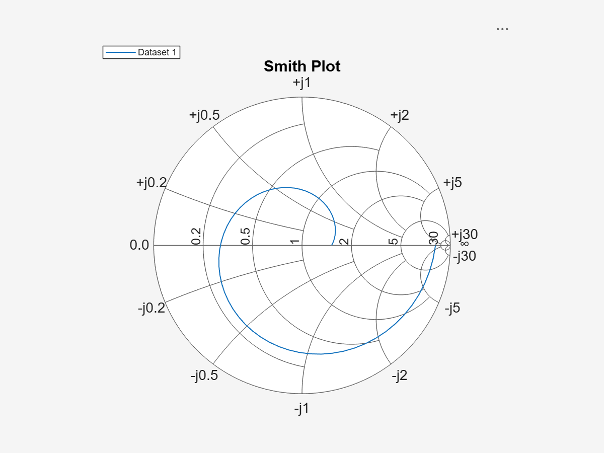

```matlab
chart = plot(component, complexData)
chart = plot(component, frequency, complexData)
chart = plot(component, networkData, ___)
chart = plot(component, ___, Name=Value)
```

```matlab
angle = linspace(0, 2*pi, 100);
gamma = 0.6*exp(1i*angle);

plot(app.uismithplot, gamma)
app.uismithplot.TitleTop = "Reflection Coefficient";
```

### Word Cloud (`uiwordcloud`)

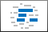

Pass words and their corresponding sizes to `plot`. You can also set
`WordData` and `SizeData` directly. The method follows
[`wordcloud`](https://www.mathworks.com/help/matlab/ref/wordcloud.html).

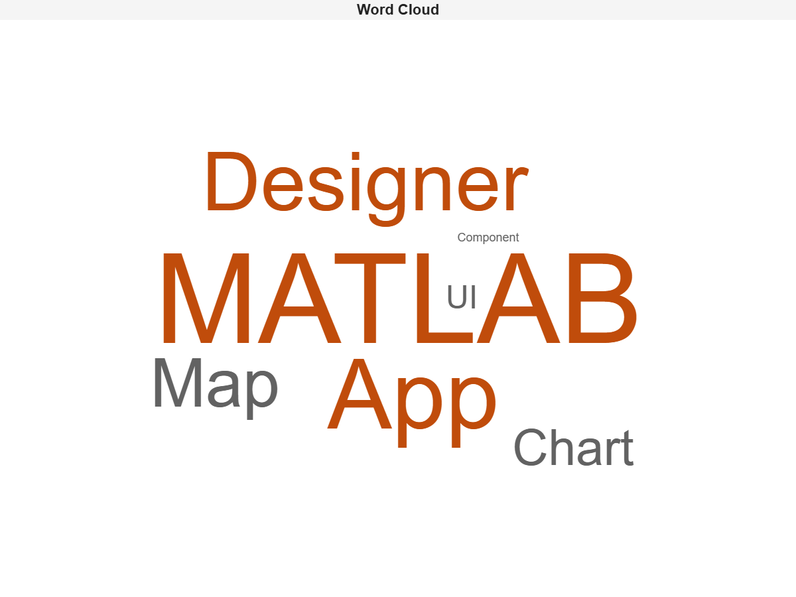

```matlab
chart = plot(component, words, sizeData)
chart = plot(component, tableData, wordVariable, sizeVariable)
chart = plot(component, categoricalData)
chart = plot(component, ___, Name=Value)
```

```matlab
words = ["MATLAB" "App" "Designer" "Charts"];
sizes = [10 7 5 4];

plot(app.uiwordcloud, words, sizes)
app.uiwordcloud.Title = "Word Cloud";
```

### Bubble Cloud (`uibubblecloud`)

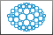

Pass bubble sizes and labels to `plot`. Set `Title`, `LegendTitle`, and
`LegendVisible` through the component properties. The method follows
[`bubblecloud`](https://www.mathworks.com/help/matlab/ref/bubblecloud.html).

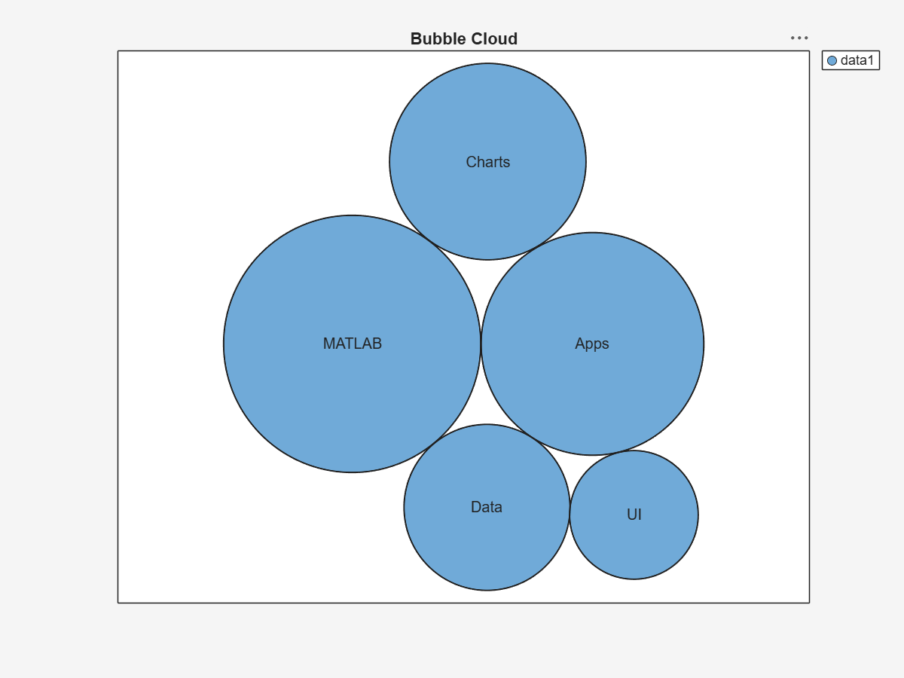

```matlab
chart = plot(component, sizes)
chart = plot(component, sizes, labels)
chart = plot(component, sizes, labels, groups)
chart = plot(component, tableData, sizeVariable, ___)
chart = plot(component, ___, Name=Value)
```

```matlab
sizes = [10 7 5 3];
labels = ["MATLAB" "Apps" "Charts" "Data"];

plot(app.uibubblecloud, sizes, labels)
app.uibubblecloud.Title = "Bubble Cloud";
```

### Geographic Bubble Chart (`uigeobubble`)

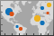

Pass latitude, longitude, and bubble-size data to `plot`. Use `Basemap` and
`MapLayout` to customize the map. The method accepts the data arguments of
[`geobubble`](https://www.mathworks.com/help/matlab/ref/geobubble.html).

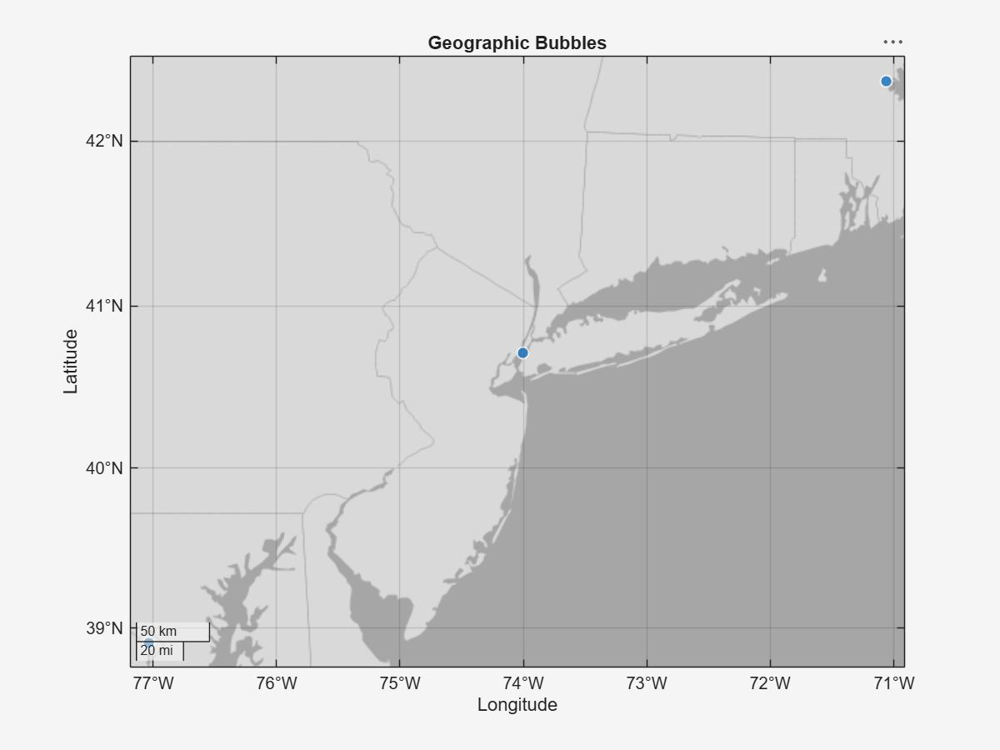

```matlab
chart = plot(component, latitude, longitude)
chart = plot(component, latitude, longitude, sizeData)
chart = plot(component, latitude, longitude, sizeData, colorData)
chart = plot(component, tableData, latitudeVariable, longitudeVariable)
chart = plot(component, ___, Name=Value)
```

```matlab
latitude = [42.36 40.71];
longitude = [-71.06 -74.01];
sizes = [12 8];

plot(app.uigeobubble, latitude, longitude, sizes)
app.uigeobubble.Basemap = "streets-light";
```

### Confusion Matrix Chart (`uiconfusionchart`)

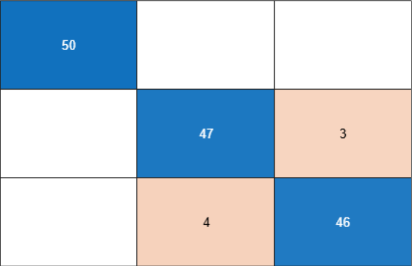

Pass known and predicted class labels to `plot`. Use `Normalization`,
`RowSummary`, and `ColumnSummary` to control the displayed statistics.
The method follows
[`confusionchart`](https://www.mathworks.com/help/stats/confusionchart.html).

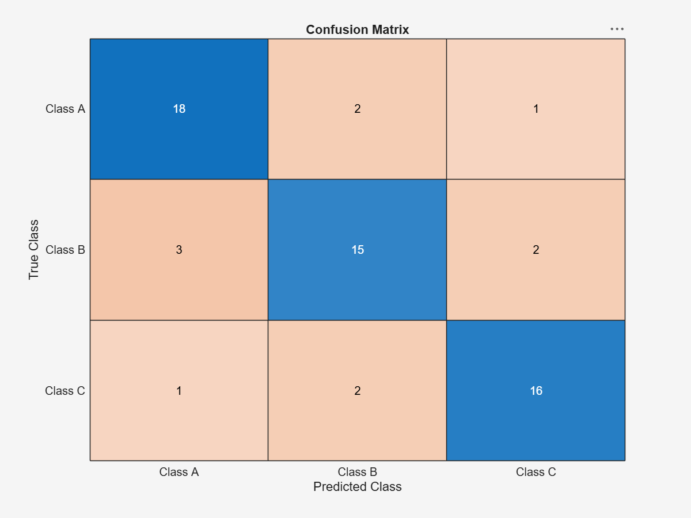

```matlab
chart = plot(component, trueLabels, predictedLabels)
chart = plot(component, confusionMatrix)
chart = plot(component, confusionMatrix, classLabels)
chart = plot(component, ___, Name=Value)
```

```matlab
actual = categorical([1 1 2 2 3 3]);
predicted = categorical([1 2 2 2 3 1]);

plot(app.uiconfusionchart, actual, predicted)
app.uiconfusionchart.Title = "Classification Results";
```

### Slice Viewer (`uisliceviewer`)

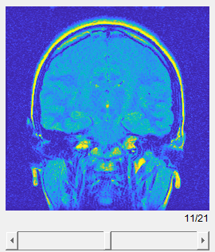

Load a 3-D image volume and pass it to `plot`. Set `SliceDirection` to `"X"`,
`"Y"`, or `"Z"` to choose the initial slicing direction. Name-value arguments
follow [`sliceViewer`](https://www.mathworks.com/help/images/ref/sliceviewer.html).

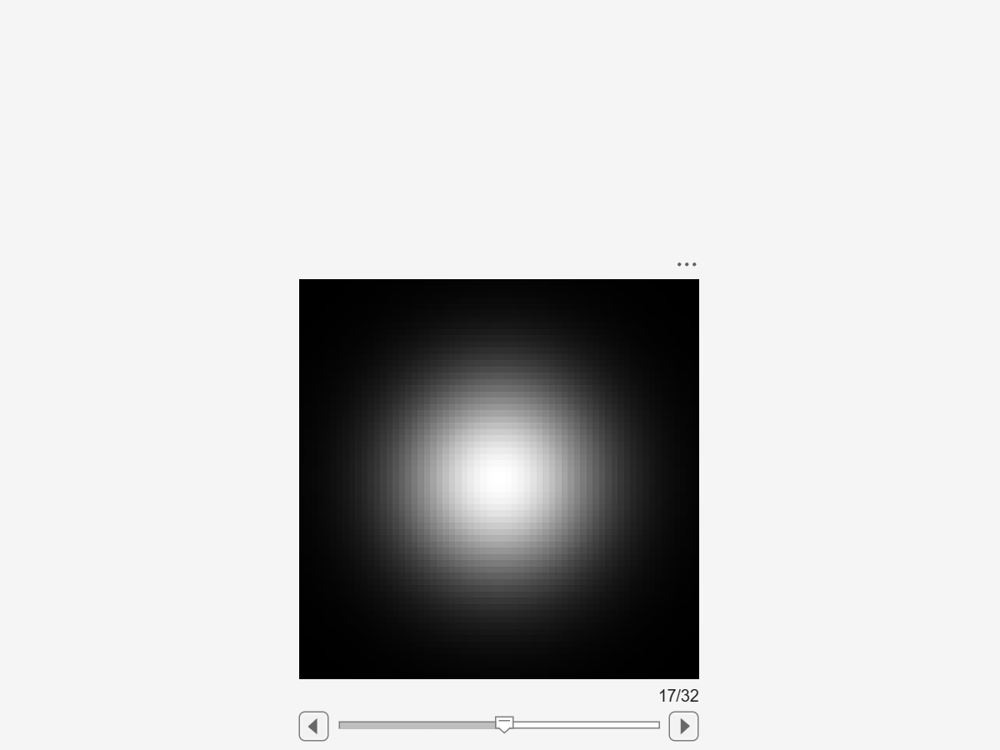

```matlab
viewer = plot(component, volumeData)
viewer = plot(component, volumeData, Name=Value)
```

```matlab
load mri
V = squeeze(D);

plot(app.uisliceviewer, V)
app.uisliceviewer.SliceDirection = "Z";
```

### Orthogonal Slice Viewer (`uiorthosliceviewer`)

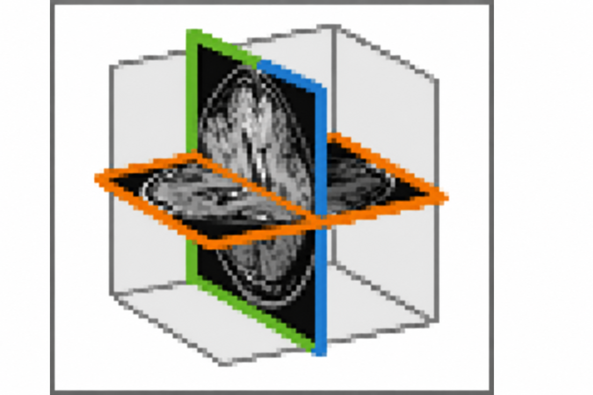

Pass a 3-D image volume to `plot` to display three linked orthogonal slices.
Use `CrosshairEnable` and `ScaleFactors` to configure the viewer.
Name-value arguments follow
[`orthosliceViewer`](https://www.mathworks.com/help/images/ref/orthosliceviewer.html).

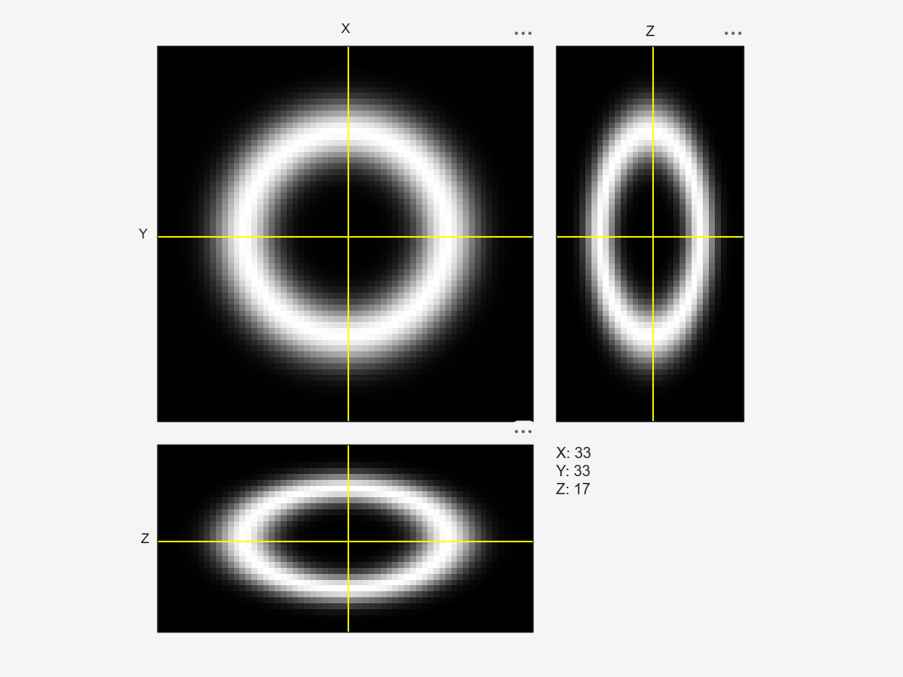

```matlab
viewer = plot(component, volumeData)
viewer = plot(component, volumeData, Name=Value)
```

```matlab
load mri
V = squeeze(D);

plot(app.uiorthosliceviewer, V)
app.uiorthosliceviewer.CrosshairEnable = "on";
```

### Volume Visualization (`uivolshow`)

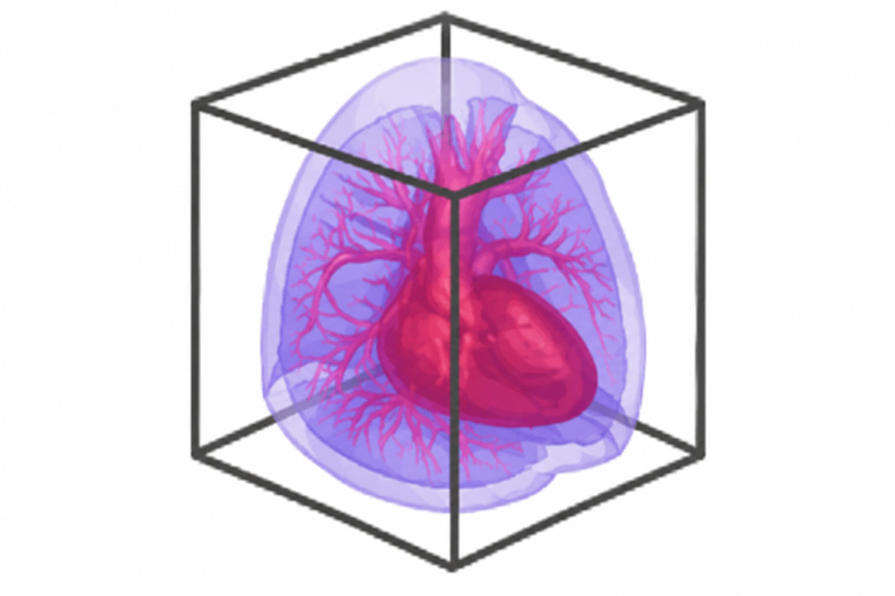

Pass a 3-D image volume to `plot`. After loading the data, set
`RenderingStyle`, `BackgroundGradient`, or `Denoising` to customize the
display. Additional inputs follow
[`volshow`](https://www.mathworks.com/help/images/ref/volshow.html).

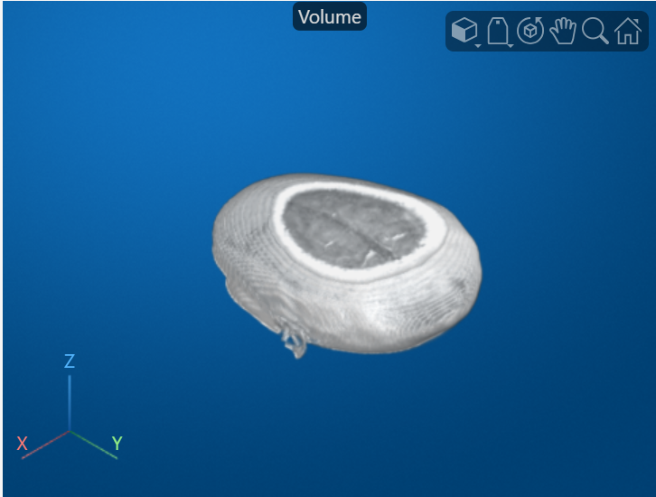

```matlab
volume = plot(component, volumeData)
volume = plot(component, volumeData, renderingConfig)
volume = plot(component, volumeData, Name=Value)
```

```matlab
load mri
V = squeeze(D);

plot(app.uivolshow, V)
app.uivolshow.RenderingStyle = "MaximumIntensityProjection";
```

### Antenna Radiation Pattern (`uipattern`)

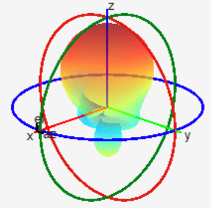

The Antenna Toolbox `pattern` method does not support a parent container or
UI axes. `uipattern` calls `pattern` for numeric outputs and renders the
result as an interactive 3-D surface in its own UI axes. Add `uipattern` to an
app from **Visualization - RF & Antennas** in the Component Library, then call
its `plot` method from a callback. Data arguments and name-value options follow
[`pattern`](https://www.mathworks.com/help/antenna/ref/cavity.pattern.html).

Unlike the native pattern viewer, this component does not include the
Show/Hide/Overlay Antenna menu. Use the axes toolbar to rotate, pan, zoom, and
inspect the rendered pattern.

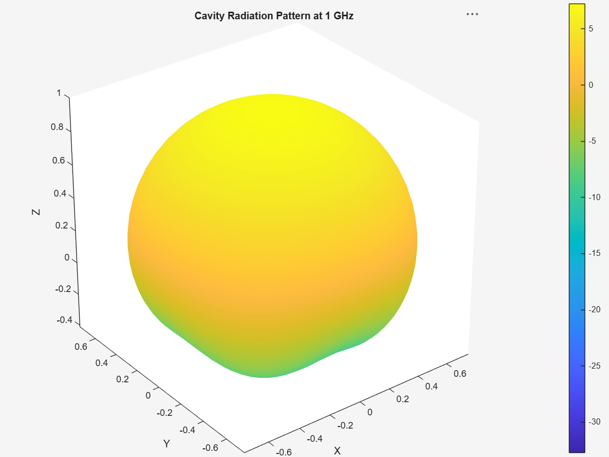

```matlab
surfaceObject = plot(component, antennaObject, frequency)
surfaceObject = plot(component, antennaObject, frequency, ...
    azimuth, elevation)
surfaceObject = plot(component, ___, Name=Value)
```

For example, place `uipattern` in an app and add the following code to a button
callback:

```matlab
antennaObject = design(cavity, 1e9);
plot(app.uipattern, antennaObject, 1e9, ...
    Type="directivity")
```

To control the angular sampling:

```matlab
azimuth = -180:5:180;
elevation = -90:5:90;

plot(app.uipattern, antennaObject, 1e9, ...
    azimuth, elevation, Type="directivity")
```

Set `DynamicRange`, `Colormap`, `ShowColorbar`, and `Title` to customize the
component display:

```matlab
app.uipattern.Title = "Cavity Pattern at 1 GHz";
app.uipattern.DynamicRange = 30;
app.uipattern.ShowColorbar = "on";
app.uipattern.Colormap = turbo(256);
```

See `uipattern_demo.mlapp` for a complete App Designer example.

Most components include a corresponding `*_demo.mlapp` file with a complete
App Designer example.

## MathWorks Products

Requires MATLAB R2024a or newer. Components marked **MATLAB** in the table
above have no additional product requirement.

Some wrapped functions accept inputs supplied by more than one product. In
particular, `uismithplot` accepts compatible network-parameter objects from
RF Toolbox, Antenna Toolbox, and SerDes Toolbox. `uipattern` dispatches to the
`pattern` method implemented by the supplied antenna object; the documented
workflow uses Antenna Toolbox.

### System Requirements

[Operating system requirements](https://www.mathworks.com/support/requirements/previous-releases.html)

## License

The license is available in [license.txt](license.txt).

---

## Development

Run the fast test suite from the repository root:

```matlab
suite = testsuite("tests");
isSlow = arrayfun(@(test) any(string(test.Tags) == "Slow"), suite);
results = run(suite(~isSlow));
assertSuccess(results)
```

Runtime construction tests are tagged separately because graphics startup can
take longer:

```matlab
results = run(testsuite("tests", Tag="Slow"));
assertSuccess(results)
```
